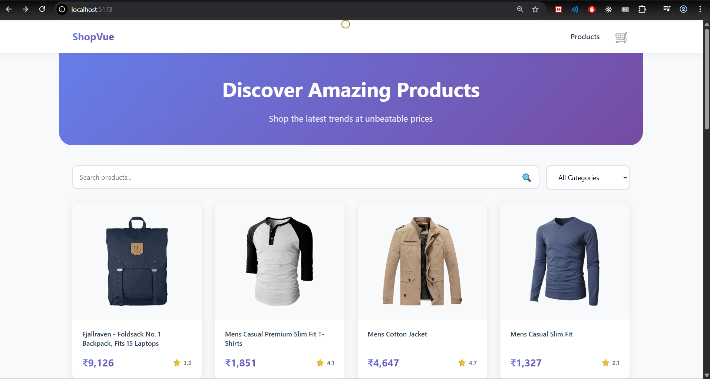
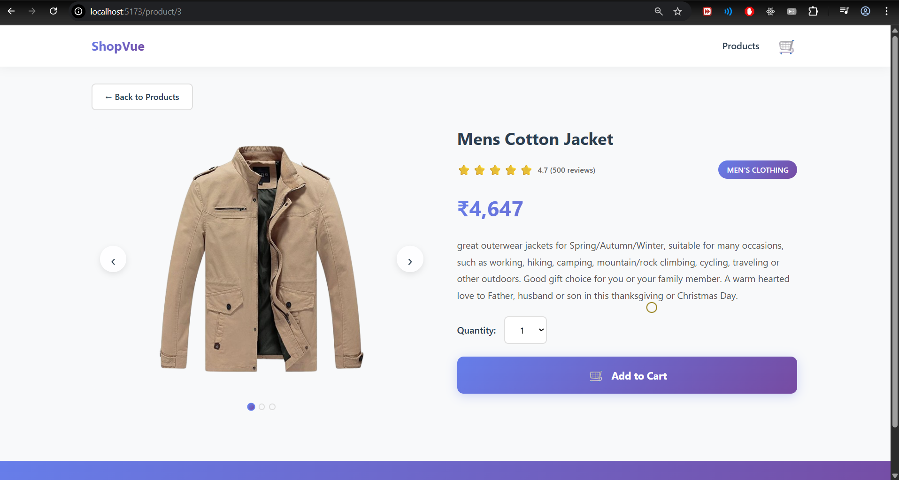
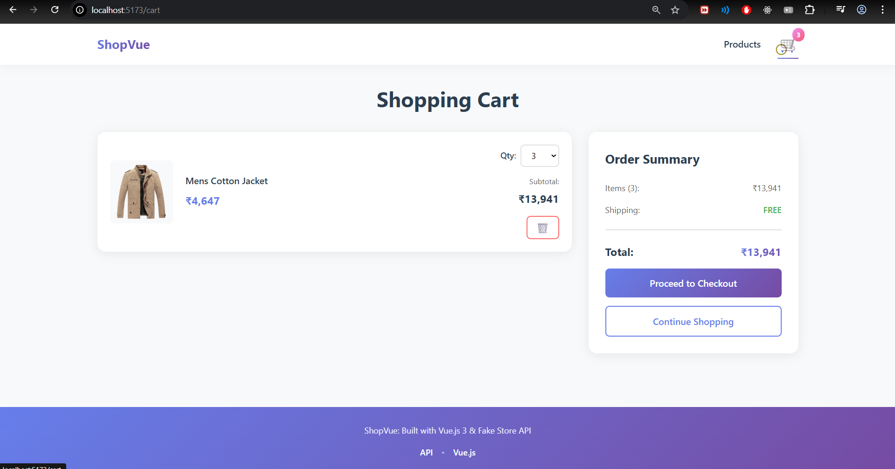
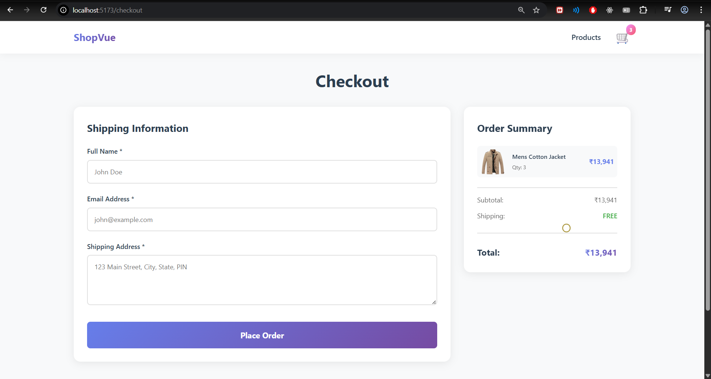

# ShopVue - Modern Mini E-Commerce Application

A sleek and responsive single-page e-commerce web app built with Vue.js 3 and TypeScript, featuring a modern UI, smooth animations, and state management with Pinia. ShopVue lets users browse, filter, and purchase products with a delightful, responsive experience. 

[](https://shop-vue-three.vercel.app/)

## 🖥️ Preview

Here’s how the homepage looks:


Here’s how the product-card-page looks:


Here’s how the product-detail-page looks:


Here’s how the checkout-page looks:


## Features

- **Product Listing Page**: Browse all products with search and category filtering
- **Product Detail Page**: View detailed product information with image carousel
- **Shopping Cart**: Manage cart items with quantity adjustment
- **Checkout Page**: Complete purchase with form validation and order confirmation
- **Custom Circular Cursor**: Unique moving cursor effect (desktop only)
- **Responsive Design**: Mobile-first approach, works on all devices
- **Smooth Animations**: Fade-in, slide-up, and scale animations throughout
- **State Management**: Pinia for global state (cart, products)
- **Persistent Cart**: Stored in localStorage for session retention

## Tech Stack

- **Vue.js 3** - Progressive JavaScript framework
- **TypeScript** - Type-safe code
- **Vue Router** - Client-side routing
- **Pinia** - State management
- **Axios** - HTTP client for API requests
- **Vite** - Fast build tool
- **Fake Store API** - Product data source

## Project Structure

```
src/
├── components/          # Reusable UI components
│   ├── Navbar.vue
│   ├── Footer.vue
│   ├── ProductCard.vue
│   ├── Carousel.vue
│   ├── LoadingSkeleton.vue
│   └── CustomCursor.vue
├── views/              # Page components
│   ├── ProductListing.vue
│   ├── ProductDetail.vue
│   ├── ShoppingCart.vue
│   └── Checkout.vue
├── stores/             # Pinia stores
│   ├── cart.ts
│   └── product.ts
├── composables/        # Reusable logic
│   ├── useApi.ts
│   └── useCursor.ts
├── router/             # Vue Router setup
│   └── index.ts
├── App.vue             # Root component
└── main.ts             # Application entry point
```

## Setup Instructions

### Prerequisites

- Node.js (v16 or higher)
- npm or Yarn

### Installation
1. Clone the Repository

```bash
git clone https://github.com/yourusername/shopvue.git
cd shopvue
```
2. Install dependencies:

```bash
npm install
```

3. Run the development server:

```bash
npm run dev
```

4. Build for production:

```bash
npm run build
```

5. Preview production build:

```bash
npm run preview
```

## Design Decisions

### State Management

- **Pinia** was chosen for its simplicity and excellent TypeScript support
- Cart state is persisted to localStorage to maintain data between sessions
- Product data is cached to reduce redundant API calls

### API Integration

- USD prices from Fake Store API are converted to INR (₹) at 1 USD = 83 INR
- Product data is cached in memory after first fetch
- Error handling with retry functionality for failed API calls

### UI/UX Design

- **Color Scheme**: Clean gradient design with purple/blue tones (#667eea to #764ba2)
- **Typography**: System fonts for optimal performance and readability
- **Animations**: Subtle fade-in, slide, and scale effects for smooth transitions
- **Custom Cursor**: Circular cursor with mix-blend-mode for visual interest (desktop only)
- **Loading States**: Skeleton screens while fetching data
- **Responsive**: Mobile-first design with breakpoints at 768px and 1024px

### Performance Optimizations

- Lazy-loaded routes with Vue Router
- Product caching to minimize API requests
- Optimized images from Fake Store API
- Efficient state management with Pinia

## Trade-offs

1. **Fake API Limitations**: The Fake Store API provides limited product images. In production, you'd want multiple high-quality images per product.

2. **Client-Side Only**: This is a frontend-only application. In production, you'd need:
   - Backend API for secure checkout processing
   - Payment gateway integration (Stripe, Razorpay, etc.)
   - User authentication and order history
   - Admin dashboard for product management

3. **Cart Persistence**: Using localStorage is simple but limited. Production apps should use:
   - Backend database for cart persistence
   - User accounts to sync cart across devices

4. **Currency Conversion**: Static USD to INR conversion rate. Production apps should use:
   - Real-time exchange rate API
   - Backend-managed pricing

5. **Product Images**: Used same image 3 times for carousel demonstration. Real products would have multiple unique images.

## Features Implemented

1. Product listing with search and category filter.
2. Product detail page with image carousel.
3. Shopping cart with quantity management.
4. Checkout with form validation.
5. Order confirmation with animation.
6. Custom circular cursor.
7. Smooth page transitions and animations.
8. Responsive design (mobile, tablet, desktop).
9. Loading states and error handling.
10. State management with Pinia.
11. Cart persistence with localStorage.
12. Clean, maintainable code structure.

## Future Enhancements

**Planned upgrades for future versions:**

1. User authentication (Login/Signup).
2. Order history & tracking.
3. Wishlist & product reviews.
4. Real payment gateway integration.
5. Advanced filters (price range, rating).
6. Admin dashboard for inventory management.
7. Real-time currency API integration.

## Bonus Enhancements

**Implemented Beyond Basics:**

1. Custom animated circular cursor (desktop).
2. Skeleton loaders for product fetches.
3. Smooth page transitions with Vue’s transition system.
4. Error handling with retry mechanism for API failures.

## Browser Support

- Chrome (latest)
- Firefox (latest)
- Safari (latest)
- Edge (latest)

## API Reference

This application uses the [Fake Store API](https://fakestoreapi.com/):

- `GET /products` - Fetch all products
- `GET /products/:id` - Fetch single product
- `GET /products/categories` - Fetch all categories
- `GET /products/category/:category` - Fetch products by category


## License

MIT

## Author

Built with ❤️ using Vue.js 3, TypeScript, and the Fake Store API.
Developed by Neha Dhattarwal — passionate about modern, scalable web applications.
